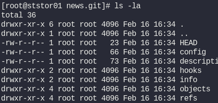

# Day 21: Set Up Git Repository on Storage Server

**Objective**: Setup and configure Git for a Storage server

**Context**: The team has provided requirements to the DevOps team for a new application development project, specifically requesting the establishment of a Git repository.

**Steps**:

```sh
ssh [user]@[hostname] #  ssh natasha@ststor01
sudo su

which git
yum install -y git
git -v
mkdir -p /opt/[PROJECT_NAME].git # create a project (news.git)
cd /opt/[PROJECT_NAME].git
git init --bare # initialize a bare git repo
ls -la

exit
```

**NOTE**:

- `natasha` is the user of storage server
- `git init --bare` creates a very specific type of repository designed for sharing, not for editing.

Think of a standard repo as a workshop (where you actually build things) and a bare repo as a warehouse (where you only store the finished products).

**Why would you use it?**

You use a bare repository when you want to set up your own server (like a private GitHub).

1. You create a bare repo on a server.
2. Multiple developers "push" their work to this bare repo.
3. Since there is no "working directory," there’s no risk of someone accidentally editing files on the server and causing a conflict when you try to push your code.

- With `ls -la` you should see a list of files, like this:


