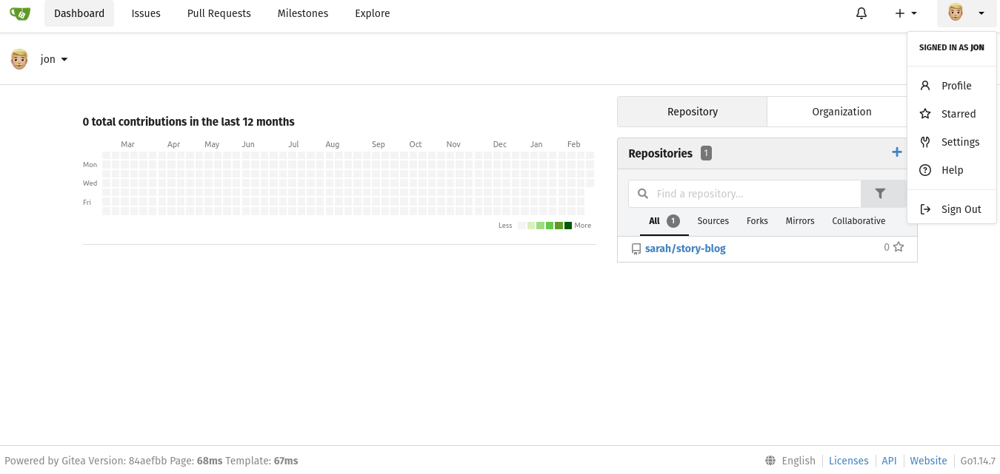
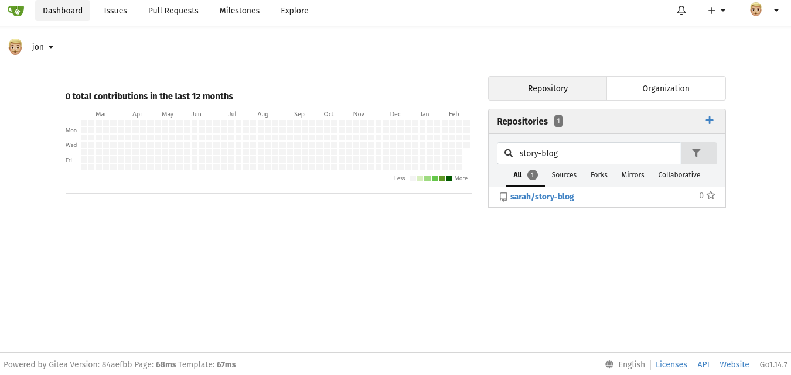
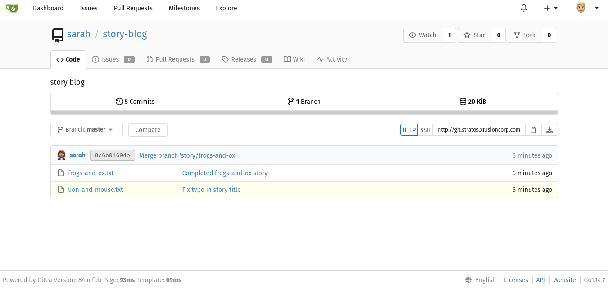
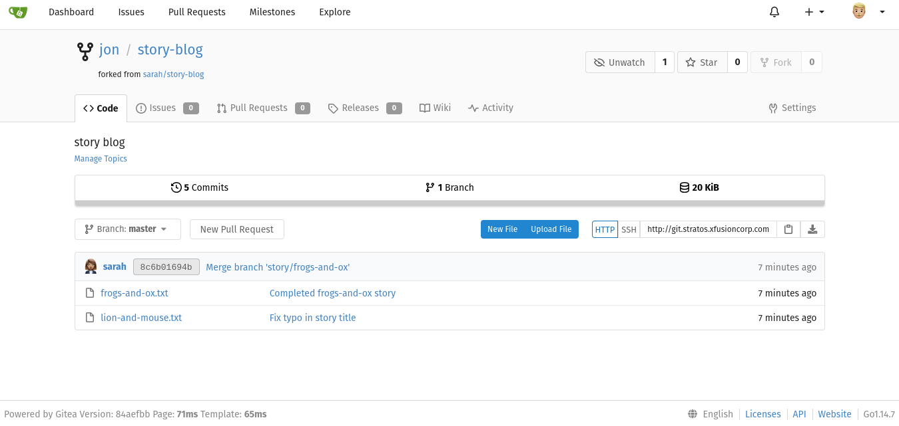

# Day 23: Fork a Git Repository

**Objective**: Get a Git server copy to work

**Context**: The team has a Git server utilized by the project teams. A new person has join the team and needs to begin working on a project.

**Steps**:

```sh
# Credentials
# url: provided by kodekloud by click in "Gitea UI" button
# username: jon
# password: Jon_pass123
# fork a repository: sarah/story-blog
```

1. Sign in



2. Locate repo "Story blog"



3. Sara' repo



4. Repository forked



**NOTE**:

- Make a video showing your steps to fork this project or use images
