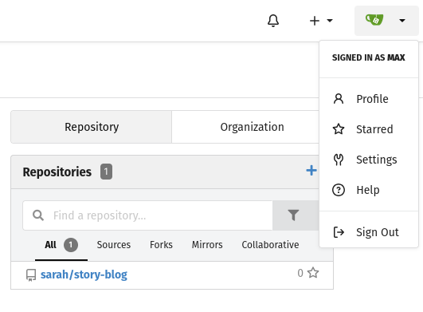
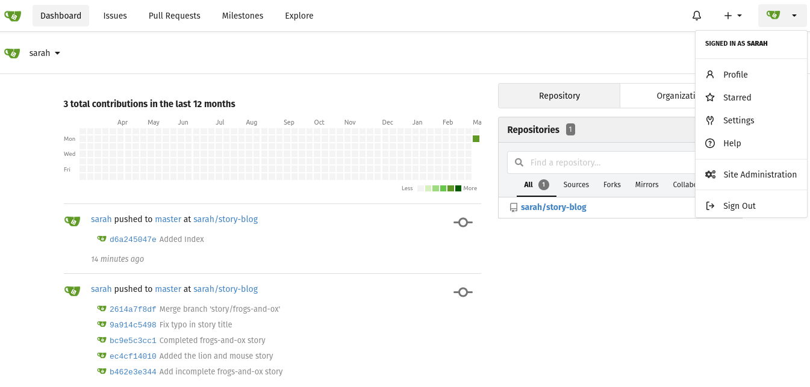
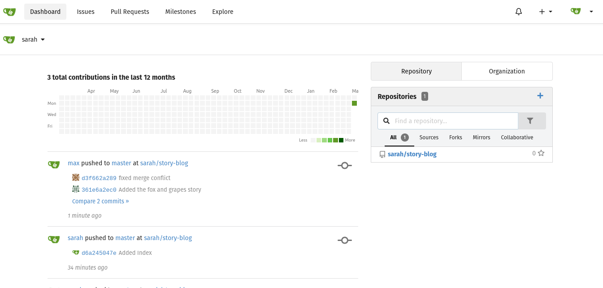

# Day 33: Resolve Git Merge Conflicts

**Objective**: Learn to resolve conflicts problems with Git merge

**Context**: Two persons where working on the same project, and both made some changes. Now one of them wants to push another changes, but he is not able to do it.

**Steps**:

```sh
ssh [user]@[hostname] #  ssh max@ststor01
sudo su -

cd /home/maxs
ls story-blog
cd story-blog
git status # you will get "Your branch is ahead of 'origin/master' by 1 commit."
git branch
git log one-line
git remote

git push rigin master #  give "max credentials", you will get an error
git pull origin master # you will get a file with merge conflicts
vi story-index.html # make the changes asked
git add .
git commit -m "XXX"  # you will get an error

# you will ask to do this step
git config --global --edit
# OR
git config --global user.name "Your Name" # max
git config --global user.email you@example.com # max@ststor01.stratos.xfusioncorp.com
git commit -m "XXX"
git push origin master
git pull origin master

# Login to gitea
# user: max, pass: Max_pass123
# OR as
# user: sarah, pass Max_pass123

exit
```







**Notes**

How Git Merge Works

When you merge, Git looks for a common base commit between your current branch and the branch you want to pull in. If you’ve both edited different files, Git handles it automatically. But if you both edited the exact same line in the same file, Git gets confused and asks for your help. This is a Merge Conflict.

Let’s say you are merging feature-branch into main. Both branches changed a line in `app.py`.

1. Start the merge

```sh
git checkout main
git merge feature-branch
> CONFLICT (content): Merge conflict in app.py. Automatic merge failed; fix conflicts and then commit the result.
```

2. Locate the Conflict, open `app.py`

```sh
<<<<<<< HEAD
print("Hello from the Main Branch")
=======
print("Hello from the Feature Branch")
>>>>>>> feature-branch
```

- `<<<<<<< HEAD`: Everything below this is what currently exists on your main branch.

- `=======`: The divider between the two versions.

- `>>>>>>> feature-branch`: Everything above this is what is coming from the branch you're trying to

3. Fix the Code

To resolve it, you manually delete the markers (`<<<<`, `====`, `>>>>`) and edit the code to what it should look like. Maybe you want both, or maybe just one.

4. Finalize the Merge

```sh
git add app.py
git commit -m "Resolved merge conflict in app.py"
```

> [!IMPORTANT] You can always cancel a messy merge by typing `git merge --abort`.

> [!IMPORTANT] Check status: Use git status during a conflict to see exactly which files need your attention.
