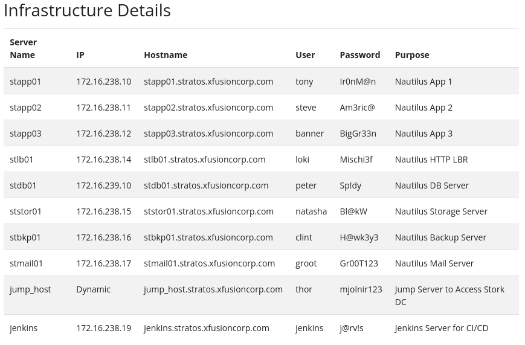

# 100 Days of DevOps

This project documents the challenge **100 Days of DevOps** of [KodeCloud](https://kodekloud.com/100-days-of-devops).

## Project Goals

- Master Infrastructure as Code (Terraform, Ansible).
- Deep dive into Containerization and Orchestration (Docker, Kubernetes).
- Build robust CI/CD pipelines (Jenkins, GitHub Actions).
- Gain hands-on experience with Cloud Providers (AWS/Azure/GCP).

## Tech Stack

- **Cloud:** AWS / Azure
- **Containers:** Docker, Kubernetes
- **IaC:** Terraform, Ansible
- **CI/CD:** Jenkins, GitHub Actions
- **Monitoring:** Prometheus, Grafana

## Nautilus Server

KodeCloud will provide you with a Nautilus GitHub repository, please check that repo. There you will find a full list of users and servers to make the exercises.

**Connect to server**

Here, we will connect to "Server 1" with the user "tony", and with password "Ir0nM@n" as example. For more information check the list in Nautilus' repo.

```sh
# basic example
> <user>@<hostname> # this is the basic prompt

# check your host name
> hostname

# Connect to a server
> ssh <user>@<hostname>
> shh tony@stapp01
# 0R
> shh tony@stapp01.stratos.xfusioncorp.com
# here you will prompt to enter "tony" password
Ir0nM@n

# leave server
> exit
```

**Nautilus Infrastructure**



## Days

- [x] Day 1: Linux User Setup with Non-Interactive Shell
- [x] Day 2: Temporary User Setup with Expiry
- [x] Day 3: Secure Root SSH Access
- [x] Day 4: Script Execution Permissions
- [x] Day 5: SElinux Installation and Configuration
- [x] Day 6: Create a Cron Job
- [x] Day 7: Linux SSH Authentication
- [x] Day 8: Install Ansible
- [x] Day 9: MariaDB Troubleshooting
- [x] Day 10: Linux Bash Scripts
- [x] Day 11: Install and Configure Tomcat Server
- [x] Day 12: Linux Network Services
- [x] Day 13: IPtables Installation And Configuration
- [x] Day 14: Linux Process Troubleshooting
- [x] Day 15: Setup SSL for Nginx
- [x] Day 16: Install and Configure Nginx as an LBR
- [x] Day 17: Install and Configure PostgreSQL
- [x] Day 18: Configure LAMP server
- [x] Day 19: Install and Configure Web Application
- [x] Day 20: Configure Nginx + PHP-FPM Using Unix Sock
- [x] Day 21: Set Up Git Repository on Storage Server
- [x] Day 22: Clone Git Repository on Storage Server
- [x] Day 23: Fork a Git Repository
- [x] Day 24: Git Create Branches
- [x] Day 25: Git Merge Branches
- [x] Day 26: Git Manage Remotes
- [x] Day 27: Git Revert Some Changes
- [x] Day 28: Git Cherry Pick
- [x] Day 29: Manage Git Pull Requests
- [x] Day 30: Git hard reset
- [x] Day 31: Git Stash
- [x] Day 32: Git Rebase
- [x] Day 33: Resolve Git Merge Conflicts
- [x] Day 34: Git Hook
- [x] Day 35: Install Docker Packages and Start Docker Service
- [x] Day 36: Deploy Nginx Container on Application Server
- [x] Day 37: Copy File to Docker Container
- [] Day 38: Pull Docker Image
